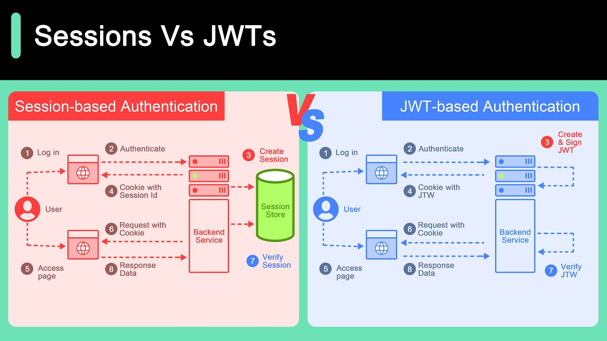

# Backend TS

This is the **Project 2 backend repository**. It covers the implementation details and setup used during the development of Project 2.

---

### Week 4 Content Structure

- [Project 2: Tech Stack Discussion](#project-2-tech-stack-discussion)
- [Basic Setup](#basic-setup)
- [Database installation & connection setup](#Database-installation-&-connection-setup)
- [Database Creation & other packages]()
- [Theory : Encryption & Decryption , Hashing : bcrypt & authentication](#password-encryption-decryption-hashing-bcrypt-authentication)
- [Class Based Register(Controller) Approach + Bcypt Demo](#class-based-controllers--bcrypt-demonstration)
- [Login Flow & SSO so on....](#session--login-flow--sso-and-more)
- [Web Authentication](#session--web-authentication-jwt-cookies-localtorage-session-summarization--other)
- [Create Institute (RAW MySQL & POST : 1)](#session--create-institute-raw-mysql--post--1)
- [Institute (Raw MySQl) & Middleware : 2](#session--institute-raw-mysql--middleware--2)
- [Middleware, DataPassing & User Model Update : 3](#sessions--middleware-datapassing--user-model-update--3)
- [Error Handling & Table Formatiings](#1-error-handling)
- [File Handling : Multer + Local/Cloudinary](#session--file-handling-course-thumbnail--multer--2)
- [File Handling : Multer + Local/Cloudinary](#session--file-handling-course-thumbnail--multer--2)
- [Institute Tables Update, QueryTypes , UUID() , categoryId & JOIN](#session--institute-tables-update-querytypes--uuid--categoryid--join)
- [Teacher Controller, Update:T/C > course , teacher, institute](#session--teachercontroller--other-updating-institute-course-else)
- [Teacher Password & Mails : PENDING | TODO](#session--teacher-password--email-sent-elses)
- [Backend Almost Finished]
- [controller|route/Teacher/ Courses > Chapters , Lessons > RBAC]()

- [Some Changes Or Bug 🐛 Fixed]()

---

### Project 2: Tech Stack Discussion

1. **Frontend:** [Next.js](https://nextjs.org/)
2. **Backend:** `Node.js` with `TypeScript`
3. **Database:** `MySQL`
4. **Others:** etc...

---

<br>
<br>

## Session : Basic Setup

### 1. Install Packages

```bash
npm init -y
npm i dotenv express nodemon
npm i -D typescript
npx tsc --init
```

📌 **Important Notes:**

- Optional (but recommended): If TypeScript shows type-related errors, install type definitions:
  ```bash
  npm i -D @types/express
  ```
- The `-D` flag installs packages under `devDependencies`, which are used **only during development**, not in production.

---

### 2. Setup Basic Files

#### _src/config/config.ts_

```ts
// This file manages configurations and acts as a global variable store for better state handling.

import { config } from "dotenv";
config();
export const envConfig = {
  portNumber: process.env.PORT || 4000,
  name: process.env.NAME || "Digital Pathsala P2",
  username: process.env.USERNAME || "username",
  password: process.env.PASSWORD || "password",
};
```

#### _src/app.ts_

```ts
import express from "express";
const app = express();
app.use(express.json());
app.get("/", (req, res) => {
  res.send("Welcome to Digital Pathsala P2!");
});
export default app;
```

#### _server.ts_ : (root level, outside the `src` folder)

```ts
console.log("Loading app...");
import app from "./src/app";
import { envConfig } from "./src/config/config";
console.log("Starting server...");
function startServer() {
  const port = envConfig.portNumber;
  app.listen(port, () => {
    console.log(`🚀 Server is running at http://localhost:${port}`);
  });
}
startServer();
```

---

### Additional Info

#### _package.json_

```json
"scripts": {
  "start": "nodemon server.ts"
}
```

📍 Ensure that `server.ts` is placed **at the root level**, not inside the `src` folder.

💡 **Note:**
If you're using TypeScript (`ts/tsx`) with external libraries or frameworks, and they support **type declarations**, it's a good practice to install them:

```bash
npm i -D @types/package-name
```

---

<br>
<br>

## Session : Database installation & connection setup

1. [XAMPP installation Website](https://www.apachefriends.org/index.html)
2. Packages installation

```bash
# orm
npm i sequelize
# database driver
npm i mysql2
```

3. Some Code Files

#### _src/database/connection.ts_

```ts
import { Sequelize } from "sequelize";
import { envConfig } from "../config/config";
const sequelize = new Sequelize({
  database: envConfig.database.database,
  username: envConfig.database.username,
  password: envConfig.database.password,
  host: envConfig.database.host,
  dialect: "mysql",
  port: Number(envConfig.database.port),
});
console.log("connection");
sequelize
  .authenticate()
  .then(() => {
    console.log("Database connection has been established successfully.");
  })
  .catch((error) => {
    console.error("Unable to connect to the database:", error);
  });
export default sequelize;
```

<br>
<br>

## Session : Database Creation & other packages

1. 📦 Sequelize vs Sequelize-TypeScript
   A. sequelize

- Official ORM library.
- Works with both JavaScript and TypeScript.
- Models are defined using .init() method.

#### _models/user.model.ts_

```ts
import { Model, DataTypes } from "sequelize";
export class User extends Model {}
User.init(
  {
    id: {
      type: DataTypes.UUID,
      defaultValue: DataTypes.UUIDV4,
      primaryKey: true,
    },
    username: {
      type: DataTypes.STRING,
    },
    email: {
      type: DataTypes.STRING,
      unique: true,
    },
  },
  {
    sequelize,
    modelName: "user",
    tableName: "users",
    timestamps: true,
  }
);
```

B. sequelize-typescript

- Wrapper around Sequelize for TypeScript users.
- Uses decorators like @Table, @Column.
- Cleaner and easier with TypeScript.

#### _models/user.model.ts_

```ts
import { Table, Column, Model, DataType } from "sequelize-typescript";
@Table({
  tableName: "users",
  timestamps: true,
})
export default class User extends Model {
  @Column({
    type: DataType.UUID,
    defaultValue: DataType.UUIDV4,
    primaryKey: true,
  })
  id!: string;
  // alternative 2 : id: string | undefined;

  @Column({
    type: DataType.STRING,
  })
  username!: string;

  @Column({
    type: DataType.STRING,
    unique: true,
  })
  email!: string;
}
```

<br>

### Code Complexity

| Criteria        | Sequelize           | Sequelize-TypeScript     |
| --------------- | ------------------- | ------------------------ |
| Lines of Code   | More (\~30+ LOC)    | Fewer (\~20 LOC)         |
| Readability     | Moderate            | High                     |
| Maintainability | Moderate            | Easier in TypeScript     |
| Suitable For    | JavaScript/TS mixed | TypeScript-only projects |

---

#### 2. ⚙️ tsconfig.json : decorators

- Settings for sequelize-typescript
  When using decorators (like @Table, @Column) in TypeScript (required by sequelize-typescript), you need to enable these two options:

```json
{
  "compilerOptions": {
    "experimentalDecorators": true,
    "emitDecoratorMetadata": true
  }
}
```

🔍 What do they do?

- Without `experimentalDecorators`

TypeScript will throw an error when it sees any decorator:
"Experimental support for decorators is a feature that is subject to change..."

- Without emitDecoratorMetadata

Sequelize-TypeScript won’t get type info like String, Number, etc., and your model definitions won't work as expected.

#### ✅ Example _tsconfig.json_ snippet

```json
{
  "compilerOptions": {
    "target": "ES2020",
    "module": "commonjs",
    "strict": true,
    "experimentalDecorators": true,
    "emitDecoratorMetadata": true,
    "esModuleInterop": true,
    "skipLibCheck": true,
    "forceConsistentCasingInFileNames": true
  }
}
```

<br>
<br>

## Session : 🔐 Backend Security (Encryption, Hashing & Authentication) & Other

### 1. Traditional Encryption & Decryption

- **Encryption** transforms plain data into unreadable format using a key (e.g., ([_AES_](https://www.npmjs.com/package/aes))).
- **Decryption** uses the same or a private key to reverse the data.
- Useful for **transmitting sensitive data**, but **not ideal for storing passwords**.

### 2. Hashing ([_bcrypt_](https://www.npmjs.com/package/bcrypt))

- **Hashing** converts a password into a fixed-length string (irreversible).
- `bcrypt` adds salt and performs multiple rounds for secure storage.
- ✅ Passwords are hashed before saving and compared securely using `bcrypt.compare()`.

### 3. Authentication

- Validates user identity through credentials.
- Process:
  - Input credentials → Hash check → Token/session created.
- Tokens (e.g., JWT) are commonly used for stateless auth.

### 4. Man-in-the-Middle ([_MITM_](https://www.rapid7.com/fundamentals/man-in-the-middle-attacks/))

- Attacker intercepts communication between client and server.
- 🔐 Prevented using **HTTPS**, secure headers, and token verification.

## 

### Bonus Tips : 📁 Folder Structure Explained

```bash
Backend/
├── src/
│   ├── config/                  # Config files (e.g., environment variables)
│   ├── controllers/
│   │   ├── global/auth/         # Auth controller (e.g., login, register)
│   │   ├── institute/           # Institute-specific logic
│   │   ├── student/             # Student-related logic
│   │   ├── super-admin/         # Super admin logic
│   │   ├── teacher/             # Teacher-related logic
│   ├── database/
│   │   ├── models/              # Sequelize models
│   │   │   └── user.model.ts
│   │   └── connection.ts        # Sequelize DB connection setup
│   ├── routes/
│   │   ├── institute/           # Routes for institute module
│   │   ├── institute/           # Routes for institute module
│   │   ├── student/             # Routes for student module
│   │   ├── super-admin/         # Routes for super admin
│   │   ├── teacher/             # Routes for teacher module
│   └── app.ts                   # Initializes express app, middlewares
├── server.ts                    # Entry point for starting the server
├── .env                         # Environment configuration (secrets, ports)
├── .gitignore                   # Ignored files in version control
├── package.json                 # NPM scripts and dependencies
├── package-lock.json            # Dependency lock file
├── tsconfig.json                # TypeScript compiler configuration
└── README.md                    # Project documentation
```

### Some Concepts : 1

#### 1. Normal Backend Approach Architecture Process

- table creation (model) -> controller(logic) -> routing (API)

#### 2. Bonus Tip

```bash
├── controllers/
│    ├──
├─── global        # Auth controller
│    ├── auth/     # Auth controller
│    ├── login/    # Login controller
│    ├── else/     # else controllers
```

So, notice that every other uses same logics for every users so just use global so it can be used for every other users(controller)

#### [3. BOLA Attack](https://owasp.org/API-Security/editions/2023/en/0xa1-broken-object-level-authorization/)

- A Bola Attack is a ranged entanglement mechanism where a thrown object consisting of multiple weighted nodes (typically 2–3) connected via flexible tethers is used to immobilize a target by inducing rotational wrap-around and kinetic entrapment.

---

<br>
<br>

## Session : Class Based Controllers & Bcrypt Demonstration

### 1. install dependecies & setups

```bash
npm install bcrypt
npm install -D @types/bcrypt
```

#### _auth.controller.ts_

```ts
import { Request, Response } from "express";
import User from "../../../database/models/user.model";
import bcrpypt from "bcrypt";
export class AuthController {
  static async registerUser(req: Request, res: Response) {
    const { username, password, email } = req.body;
    if (!username || !password || !email) {
      res.status(400).json({
        message: "user registaration unsucessfull!",
      });
      return;
    }
    console.log(username, password, email);
    User.create({
      username: username,
      // appley bcrypt-hash to the password
      // bcrypt.hasSYnc(string/number,saltValue)
      // saltValue : higher the better but for now use 12
      password: bcrypt.hasSync(password, 12),
      email: email,
    });
    res.status(200).json({
      message: "user registered successfully!",
    });
  }
}
```

#### _auth.route.ts_

```ts
import express, { Router } from "express";
import { AuthController } from "../../../controllers/global/auth/auth.controller";
const router: Router = Router();
router.route("/register").post(AuthController.registerUser);
export default router;
```

### 2. POST & HashPassword

#### POST Via Terminal (bash)

```bash
# provide methods & values
http POST http://localhost:3000/api/register username=amala email=amala@gmail.com password=password
```

- Note : [httpie](https://httpie.io/docs) is used for POST and other actions use within CLI. POSTMAN is better alternative for this GUI. All this can be Used for API testing.

#### Output of hash-password

This like be to content should be at Database.

```ts
{
   username : "amala",
   email    : "amala@gmail.com",
   password : "$2b$12$Lwu0dGPp.8xiRz8FaBXPBOOJEWKJWqTe7y/cekWSBF1SikslXyNF6",
  //  else
}
```

- **QnA**

1. will the hash-password generated will be same as other as long as unhased/unciphered text:password is same? --> _Ans: No_

```bash
# user 1
http POST http://localhost:3000/api/register username=abc email=abc@gmail.com password=password
# user 2
http POST http://localhost:3000/api/register username=def email=def@gmail.com password=password

<<comment
hased-password

 user 1 : {password:"$2b$12$MIIm6KXFJtFj2ShNjv3Yi.cbMJbqfy52L4IVmEuaP3pAC5ojX8taW"}
 user 2 : {password:"$2b$12$dtogmV3WVn7t8vs/zUUA3.ojd6XWiNHFCsUvNR39PCd898LUIbS4K"}

comment
```

- conclusion : As you noticed that even though users password might be same but after hashed the hash-text will be different

### 3. Data Validation 🔍

Data validation ensures that the data sent to or received from APIs/servers is accurate, complete, and secure. It helps prevent errors, maintain data integrity, and protect against malicious input.

There are two main types of data validation:

1. Client-Side Validation 🖥️
   Happens in the browser using JavaScript or HTML5.
   Gives instant feedback to users (e.g., ❗required fields, 🔢 format checks).
   ✅ Improves UX, ❌ but should not be trusted for security.

2. Server-Side (Backend) Validation 🛡️ :
   The most secure layer of validation, and essential for protecting your system. It can be split into:

- a. Database (Model) Validation 🗄️ – ✅ Best :
  Enforced at the database or schema/model level (e.g., Mongoose, SQL constraints).
  Automatically validates data regardless of the source.
  Ensures long-term data integrity and consistency.

- b. Application-Level Validation (API/Controller) ⚙️ – 🆗 Better :
  Done in middleware or controllers before data reaches the database.
  Good for custom rules and business logic.
  Works well with detailed error responses and logging.

### Note : ⚠️ Tip: Use both client-side 🖥️ and server-side 🛡️ validation.

- Client-side = better UX ✨
- Server-side = better security 🔐

<br>
<br>

## Session : Login Flow , SSO And More

### login flow:

1. email/username,password (basic) ::

- A. email,password --> data accept --> validation
- B. first check email exists or not (verify) -> yes -> check password -> exits -> token generation (JWT) -> now -> not registered
- google,login, fb, github(oauth) : Email login(SSO)

#### _auth/global/auth.controller.ts -> class:loginUser_

```ts
   static async loginUser(req: Request, res: Response) {
    const { email, password } = req.body;

    // Validate input: Check if both email and password are provided
    if (!(email || password)) {
      res.status(404).json({
        message: "Please provide both email and password",
      });
      return;
    }

    // Check if the email exists in the user table
    // Equivalent raw SQL query:
    // SELECT * FROM user WHERE email = "xyz@gmail.com" AND age=nums
    const data = await User.findAll({
      where: {
        email,
      },
    });

    // If no user found with the provided email, respond with error
    if (data.length === 0) {
      res.status(404).json({ message: "User not registered" });
      return;
    }

    // Compare the provided password with the hashed password stored in DB
    // bcrypt.compareSync(plainPassword, hashedPassword) returns boolean
    const isPasswordMatch = bcrypt.compareSync(password, data[0].password);

    // If password does not match, deny access
    if (!isPasswordMatch) {
      console.log("Password mismatch error");
      res.status(403).json({ message: "Invalid email or password!" });
      return;
    }

    // Successful login
    console.log("User logged in successfully");
  }
```

### Login Methods

| Login Method         | Description                                      |
| -------------------- | ------------------------------------------------ |
| Email/Password Login | You enter email + password directly in app.      |
| SSO via Google       | You click "Login with Google" → one-click login. |

<br>

### Difference bet<sup>n</sup> hashSync & compareSync in bcrypt ?

## Session : 🔐 Introduction to Web Authentication

### 🔁 1. Session-Based Authentication (Traditional)

Where is the login data stored? → On the server.
<br>
🔧 How it works:

1. User logs in with email/password.
2. Server creates a session (usually in memory or DB).
3. Server sends a session ID to the client (stored in a cookie).
4. On every request, the client sends the cookie.
5. Server looks up the session ID to get the user data.

#### ✅ Pros:

1. Secure (especially with HTTP-only cookies).
2. Easy to invalidate sessions (just delete from server).

#### ❌ Cons:

1. Not scalable by default (requires centralized memory or DB).
2. Harder to work with mobile apps or APIs (cookie support needed).

<br>

### 🪙 2. JWT-Based (Token) Authentication

Where is the login data stored? → On the client.
<br>
🔧 How it works:

1. User logs in.
2. Server generates a JWT token (contains user ID + expiry).
3. Token is sent to client (stored in cookie/localStorage).
4. On every request, client sends token (usually in Authorization header).
5. Server verifies token → if valid, user is authenticated.

#### ✅ Pros:

1. Stateless (no need to store sessions on server).
2. Easier to scale (good for microservices, APIs).
3. Works great for mobile apps, SPAs, and cross-origin apps.

#### ❌ Cons:

1. Harder to revoke (you can’t "delete" a token stored on the client).
   If stolen, attacker can use it until it expires.
2. Needs secure storage (avoid localStorage for sensitive data).



#### QnA :

1. 🔓 Can the token be decrypted?

- No — if you're using a signed JWT, not encrypted JWT, it can't be decrypted. The contents (payload) are Base64-encoded, not encrypted.
- Anyone with access can read the payload (not the signature), but can't alter it without invalidating the signature.

<br><br>

## Session : Web Authentication JWT, cookies, localtorage, session Summarization & Other

### [Explained (Basic Here)](#session--web-authentication-jwt-cookies-localtorage-session-summarization--other)

### Cross-Site Scripting Introduction ([LINK](https://duckduckgo.com/?q=cross+site+scripting))

<br>
<br>

## Session : Create Institute (Raw MySQl) & POST :: 1

This session will contain : Creating Table for institute via Raw MySQL

### 1. src/controller/institute/institute.controller.ts

```ts
import { Request, Response } from "express";
import sequelize from "../../database/connection";
import { generateRandomInstituteNumber } from "../../services/generateRandomInstituteNumber.service";
export class InstituteController {
  static async createInstitue(req: Request, res: Response) {
    const {
      instituteName,
      instituteEmail,
      institutePhoneNumber,
      instituteAddress,
    } = req.body;

    const instituteVatNo = req.body.instituteVatNo || null;
    const institutePanNo = req.body.institutePanNo || null;
    if (
      !(
        instituteName ||
        instituteEmail ||
        institutePhoneNumber ||
        instituteAddress
      )
    ) {
      res.status(400).json({ message: "Data Invalid" });
      return;
    }

    const tableId = generateRandomInstituteNumber();
    const tableName = `institute_${tableId}`;

    // Create table
    await sequelize.query(
      `CREATE TABLE IF NOT EXISTS ${tableName} (
        id INT NOT NULL PRIMARY KEY AUTO_INCREMENT,
        instituteName VARCHAR(255) NOT NULL,
        instituteEmail VARCHAR(255) NOT NULL,
        institutePhoneNumber VARCHAR(255) NOT NULL,
        instituteAddress VARCHAR(255) NOT NULL,
        institutePanNo VARCHAR(255),
        instituteVatNo VARCHAR(255),
        createdAt TIMESTAMP DEFAULT CURRENT_TIMESTAMP,
        updatedAt TIMESTAMP DEFAULT CURRENT_TIMESTAMP ON UPDATE CURRENT_TIMESTAMP
      )`
    );

    // Insert data
    await sequelize.query(
      `INSERT INTO ${tableName} (instituteName, instituteEmail, institutePhoneNumber, instituteAddress, institutePanNo, instituteVatNo) VALUES (?, ?, ?, ?, ?, ?)`,
      {
        replacements: [
          instituteName,
          instituteEmail,
          institutePhoneNumber,
          instituteAddress,
          institutePanNo,
          instituteVatNo,
        ],
      }
    );
    res.status(200).json({
      message: "Institute created",
      tableName,
    });
  }
}
```

### 2. _src/route/institute/institute.route.ts_

```ts
router.route("/institute").post(InstituteController.createInstitute);
```

### 3. _src/app.ts_

```ts
app.use("/api", instituteRoute);
```

<br>
<br>

## Session : Institute (Raw MySQl) & Middleware :: 2

- Create Table (mysql raw) : Institute Via API Call
- Middleware : A middle logic between backend/frontend and database which ensures where & when to create/hit-api to make database with checking authorization(loggedIn)
- in other word we will provide two params on route : (middleware, create/post). if middleware authenticate then it will next function or else not.

<br>

### 1. _src/middleware/middleware.ts_

```ts
export interface IExtendedRequest extends Request {
  user?: {
    name: string;
    age: number;
  };
}
export class Middleware {
  // NextFunction express based method which triggers next function/method
  static isLoggedIn(req: IExtendedRequest, res: Response, next: NextFunction) {
    const token = req.headers.authorization;

    // Verification 1: Token Checking Added or Not
    if (!token) {
      res.status(401).json({
        message: "Invalid Token",
      });
      return;
    }
    // Verification 2: Verify 'token' var-data
    jwt.verify(
      token,
      "thisisecret",
      async (errorMessage, successMessage: any) => {
        // Verify Token with 'jwt' method 'verify'
        // if not verified
        if (errorMessage) {
          res.status(403).json({
            message: "Invalid Token Intercepted !!",
          });
          return;
        }
        console.log("Middleware Accessed :: ");
        console.log("token_authentication_success_::", successMessage);

        // Verification 3: 'User' Data-List Verification
        const userData = await User.findByPk(successMessage.id);
        if (!userData) {
          res.send(403).json({
            // user not found
            message: "User Email or Pass Invalid !!",
          });
          return;
        }
        // BONUS : Pass Req[Keys]=[Values] from Middleware to route(nextFunc)
        req.user = {
          age: 22,
          name: "root",
        };
        next(); // Goes to next function execution and same for route as well
      }
    );
  }
  // static restrictTo(req: Request, res: Response, next: NextFunction) { }
}
```

<br>

#### \* `isLoggedIn()` Middleware Step by step Process:

1. Collect Token Header.authorization;

```ts
const token = req.headers.authorization;
```

2. Verify Request `token` through `jwt.verify`

```ts
jwt.verify(token, "thisisecret", async (errorMessage, successMessage: any) => {
  if (errorMessage) return;
  console.log("token_authentication_success_::", successMessage);
  // Verification 3: 'User' Data-List Verification
  const userData = await User.findByPk(successMessage.id);
  if (!userData) return;
  next();
  // Goes to next function execution and same for route as well
});
```

### 2. _src/routes/institute/institute.routes.ts_

```ts
router
  .route("/institute")
  .post(Middleware.isLoggedIn, InstituteController.createInstitute);
// Route Chaining
// if middleware gives access to `next():NextFunction` then it will trigger next route `InstituteController.createInstitute`
```

### 3. API Call via Terminal ?

```bash
# Login & get your_login_jwt_token
http POST http://localhost:3000/api/login email=xyz password=xyz

# Afterward you receive token here
{
    "token": "_token_received"
}
```

```bash
# 2. Hitting
http POST http://localhost:3000/api/institute \
  Authorization:"your_login_jwt_token" \
  instituteName="root" \
  instituteEmail="root@example.com" \
  institutePhoneNumber="root" \
  instituteAddress="root" \
  institutePanNo="root" \
  instituteVatNo="root"
```

<br>
<br>

### Bonus Tip 1: About _`NextFunction` by `express`_

The `NextFunction` Method provided by the express it's a middleware which gives access to next route to perform actions like controlling database through out API Calling.

```ts
export class Middleware {
  static isLoggedIn(req: IExtendedRequest, res: Response, next: NextFunction) {
    if (condition) next();
  }
}
```

```ts
router
  .route("/institute")
  .post(Middleware.isLoggedIn, InstituteController.createInstitute);
```

- Conclusion : if `_middleware.ts_` does not calls/gives `next()` function at the end of its logic it will prohibit the `InstituteController.createInstitute.ts` to perform api calling else database handling.

<br>
<br>

### \* Bonus Tip 2: Hold & Pass `Request[keys]:[values]` from `middleware.ts` to next route (`institute.controller.ts`)

We can check or do what ever logics need to be provided inside middleware then so on wwe can send Request[Keys]:[Values] as per requirements. It's like data chaining or layering.

```ts
// middleware.ts

export interface IExtendedRequest extends Request {
  user?: {
    name: string;
    age: number;
  };
}
export class Middleware {
  static isLoggedIn(req: IExtendedRequest, res: Response, next: NextFunction) {
    req.user = {
      age: 22,
      name: "root",
    };
    next();
  }
}
```

<br>
<br>

## Sessions : Middleware, DataPassing & User Model Update :: 3

Third Continuous part of Middleware and Data Passing. This session will cover the Extra topics like:

### 1. Add & Update user.model (Via Middleware)

```ts
// database/models/user.model.ts
import { Table, Column, Model, DataType } from "sequelize-typescript";
@Table({
  tableName: "users",
  modelName: "user",
  timestamps: true,
})
export default class User extends Model {
  // Other Columns //
  @Column({
    type: DataType.STRING,
  })
  declare currentInstituteNumber: string;
}

/*@currentInstituteNumbe : addon-column
This is added to make sure to filterout that which table/database_id user created and working
on. 
user -> request table creation -> assings tableName_table_id_999
user -> currentInstituteNumber : 999 
*/
```

```ts
// middeware/middleware.ts
export class Middleware {
  static isLoggedIn(req: IExtendedRequest, res: Response, next: NextFunction) {
    const token = req.headers.authorization;
    const { id } = req.body;
    jwt.verify(token, "thisisecret", async (errorMessage, successMessage: any) => {
      if (errorMessage) return;
      const userData = await User.findByPk(successMessage.id)
      if (!userData){}
      else { req.user = userData  next(); }
      });
     }
    }
```

```ts
//controller/institute/institute.controller.ts
export class InstituteController {
  static async createInstitute(req: IExtendedRequest, res: Response) {
    const tableId = generateRandomInstituteNumber();
    /*@updating_currentUser_currentInstituteNumber : For more check user.model.ts::file */
    if (req.user) {
      await User.update(
        {
          currentInstituteNumber: tableId,
          role: "institute",
        },
        {
          where: {
            id: req.user.id,
          },
        }
      );

      req.user.instituteNumber = tableId;
    }
  }
}
```

- Process : Create Column (instituteCurrentNumber) -> middleware_verfies_user -> institute_controller creates table & updates `currentInstituteNumber as well`

<br>
  
### 2. Make a user_institute:table
This table format/columns data filled allows us to track how many users has created tables via this column format. id | userId | instituteNumber
```bash
+----+--------------------------------------+-----------------+
| id | userId                               | instituteNumber |
+----+--------------------------------------+-----------------+
|  1 | a0564df4-58af-41ba-8c6b-17f97a77b18a |          332101 |
|  2 | a0564df4-58af-41ba-8c6b-17f97a77b18a |          743630 |
|  3 | a0564df4-58af-41ba-8c6b-17f97a77b18a |          556192 |
|  4 | b468a7fa-a6db-4ac6-9bee-2c31fddb5865 |          717745 |
|  5 | b468a7fa-a6db-4ac6-9bee-2c31fddb5865 |          128862 |
+----+--------------------------------------+-----------------+
```

```ts
//controller/institute/institute.controller.ts
export class InstituteController {
  static async createInstitute(req: IExtendedRequest, res: Response) {
    const tableId = generateRandomInstituteNumber();
    // users created tables for institute history query
    // creating a table to check each user created number of institute table details
    await sequelize.query(`CREATE TABLE IF NOT EXISTS user_institute(
      id INT NOT NULL PRIMARY KEY AUTO_INCREMENT,
      userId VARCHAR(255) REFERENCES users(id),
      instituteNumber INT UNIQUE
      )`);
    // userId VARCHAR(255) REFERENCES users(id) : id datatype:string and it should be list of users table `id` column one of a existing data

    if (req.user) {
      await sequelize.query(
        `INSERT INTO user_institute (userId,instituteNumber) VALUES(?,?)`,
        {
          replacements: [req.user.id, tableId],
        }
      );
    }
  }
}
```

<br>

### 3. Create Teacher, Student & Course Table (Raw : sequelize+SQL)

```ts
// inside controller class and below createInstitute method

  static async createTeacherTable(req: IExtendedRequest, res: Response, next: NextFunction) {
    const instituteNumber = req.user?.instituteNumber
    if (!instituteNumber) return;
    await sequelize.query(`CREATE TABLE IF NOT EXISTS teacher_${instituteNumber}(
    id INT NOT NULL PRIMARY KEY AUTO_INCREMENT,
    teacherName VARCHAR(255) NOT NULL,
    teacherEmail VARCHAR(255) NOT NULL UNIQUE,
    teacherPhoneNumber VARCHAR(255) NOT NULL UNIQUE
      )`)
    next()
  }

  static async createStudentTable(req: IExtendedRequest, res: Response, next: NextFunction) {
    const instituteNumber = req.user?.instituteNumber
    if (!instituteNumber) return;
    await sequelize.query(`CREATE TABLE IF NOT EXISTS student_${instituteNumber}(
    id INT NOT NULL PRIMARY KEY AUTO_INCREMENT,
    studentName VARCHAR(255) NOT NULL,
    studentEmail VARCHAR(255) NOT NULL UNIQUE,
    studentPhoneNumber VARCHAR(255) NOT NULL UNIQUE
      )`)
    next()
  }

  static async createCourseTable(req: IExtendedRequest, res: Response) {
    const instituteNumber = req.user?.instituteNumber;
    if (!instituteNumber) return;
    await sequelize.query(`CREATE TABLE IF NOT EXISTS course_${instituteNumber}(
      id INT NOT NULL PRIMARY KEY AUTO_INCREMENT,
      courseName VARCHAR(255) NOT NULL UNIQUE,
      coursePrice VARCHAR(255) NOT NULL
        )`)
    // end of the chaining query/functions
    res.status(200).json({
      message: "Institute Successfully created [Institute][Teacher][Course] :  " + instituteNumber
    })
  }
```

<br>

```ts
// _/src/route/institute.route.ts_
router
  .route("/institute")
  .post(
    Middleware.isLoggedIn,
    InstituteController.createInstitute,
    InstituteController.createTeacherTable,
    InstituteController.createStudentTable,
    InstituteController.createCourseTable
  );
```

This whole _InstituteController_ class defines process which are given down:

- Suppose, randomNum = randoms

1. CreateInstitute :
   a. CreateInstitute : randomN_institute
   b. create userInstitute : random_institute
2. createTeacherTable : randomN_teacher
3. createStudentTable : randomN_student
4. createCourseTable : randomN_teacher

NOTE : randomN is an unique number which assigned for every other tables for tracking user tables

<br><br>

## Session : _Error Handling_ , Table Formatting

### 1. Error Handling

- Error Handling is a process of handling some apps or software from crashing which leads users to unable to execute or use the app.
- If Software crashes during some execution i.e using features so on the software/apps needs to be restart even if it is started same feature crashes the app while using.
- For preventing such crashes, we can use errorHandling wrapper `(High Order Function)` which can used for all _controller_ / _routes_.

src/services/_errorHandler.service.ts_

```ts
const asyncErrorHandler = (fn: Function) => {
  return (req: Request, res: Response, next: NextFunction) => {
    fn(req, res, next).catch((error: Error) => {
      return res.status(500).json({
        message: error.message,
        fullError: error,
      });
    });
  };
};
```

<br>

#### Method 1 : Use inside controller

1. class based
2. functional based

<br>

#### Method 2 : Use Inside Routes

```ts
router
  .route("/institute")
  .post(
    Middleware.isLoggedIn,
    asyncErrorHandler(InstituteController.createInstitute),
    asyncErrorHandler(InstituteController.createTeacherTable),
    asyncErrorHandler(InstituteController.createStudentTable),
    asyncErrorHandler(InstituteController.createCourseTable)
  );
```

<br>

### 2. Table formatting (_institute.controller.ts_) Teacher, Student else's

#### 1. Teacher Table Formatting

```ts
static async createTeacherTable(
    req: IExtendedRequest,
    res: Response,
    next: NextFunction
  ) {
    const instituteNumber = req.user?.currentInstituteNumber;
    try {
      if (!instituteNumber) return;
      await sequelize.query(`CREATE TABLE IF NOT EXISTS teacher_${instituteNumber}(
    id INT NOT NULL PRIMARY KEY AUTO_INCREMENT,
    teacherName VARCHAR(255) NOT NULL,
    teacherEmail VARCHAR(255) NOT NULL UNIQUE,
    teacherPhoneNumber VARCHAR(255) NOT NULL UNIQUE,
    teacherExpertise VARCHAR(255),
    joinedDate DATE,
    salary VARCHAR(100),
    createdAt TIMESTAMP DEFAULT CURRENT_TIMESTAMP,
    updatedAt TIMESTAMP DEFAULT CURRENT_TIMESTAMP ON UPDATE CURRENT_TIMESTAMP
      )`);
      next();
    } catch (error) {
      console.log(" Teacher Table Error", error);
    }
  }
```

<br>

#### 2.Student Table Formatting

```ts
  static async createStudentTable(
    req: IExtendedRequest,
    res: Response,
    next: NextFunction
  ) {
    const instituteNumber = req.user?.currentInstituteNumber;
    try {
      if (!instituteNumber) return;
      await sequelize.query(`CREATE TABLE IF NOT EXISTS student_${instituteNumber}(
    id INT NOT NULL PRIMARY KEY AUTO_INCREMENT,
    studentName VARCHAR(255) NOT NULL,
    studentEmail VARCHAR(255) NOT NULL UNIQUE,
    studentPhoneNumber VARCHAR(255) NOT NULL UNIQUE,
    studentAddress TEXT,
    enrolledDate DATE,
    studentImage VARCHAR(255),
    createdAt TIMESTAMP DEFAULT CURRENT_TIMESTAMP,
    updatedAt TIMESTAMP DEFAULT CURRENT_TIMESTAMP ON UPDATE CURRENT_TIMESTAMP
      )`);
      next();
    } catch (error) {
      console.log("Student Table Error ", error);
    }
  }
```

<br>

#### 3.Course Table Formatting

```ts
  static async createCourseTable(req: IExtendedRequest, res: Response) {
    const instituteNumber = req.user?.currentInstituteNumber;
    try {
      if (!instituteNumber) return;
      await sequelize.query(`CREATE TABLE IF NOT EXISTS course_${instituteNumber}(
      id INT NOT NULL PRIMARY KEY AUTO_INCREMENT,
      courseName VARCHAR(255) NOT NULL UNIQUE,
      coursePrice VARCHAR(255) NOT NULL,
      courseDuration VARCHAR(100) NOT NULL,
      courseLevel ENUM('beginner','intermediate','advance') NOT NULL,
      courseThumbnail VARCHAR(200),
      courseDescription TEXT,
      createdAt TIMESTAMP DEFAULT CURRENT_TIMESTAMP,
      updatedAt TIMESTAMP DEFAULT CURRENT_TIMESTAMP ON UPDATE CURRENT_TIMESTAMP
        )`);

      // end of the chaining query/functions
      res.status(200).json({
        message:
          "Institute Successfully created [Institute][Teacher][student][Course] :  " +
          instituteNumber,
    });
    } catch (error) {
      console.log("CourseTable Error ,", error);
    }
  }
```

<br>
<br>

### 3. Course Controller _Institute/course/course.controller.ts_

This code will handle the insitute courses related apis database insertion.

```ts
export class CourseController {
  //  Create Course
  static async createCourse(req: IExtendedRequest, res: Response) {
    const instituteNumber = req.user?.currentInstituteNumber;
    const {
      courseName,
      coursePrice,
      courseDuration,
      courseLevel,
      courseDescription,
    } = req.body;

    if (
      !(
        courseName ||
        coursePrice ||
        courseDuration ||
        courseLevel ||
        courseDescription
      )
    ) {
      return res.status(400).json({
        message: `Provide 
        courseName
        coursePrice
        courseDuration
        courseLevel
        courseDescription`,
      });
    }
    const courseThumbnail = null;

    const returnedData = await sequelize.query(
      `INSERT INTO course_${instituteNumber}(courseName,coursePrice,courseDuration,courseLevel,courseThumbnail,courseDescription) VALUES(?,?,?,?,?,?)`,
      {
        type: QueryTypes.INSERT,
        replacements: [
          courseName,
          coursePrice,
          courseDuration,
          courseLevel,
          courseThumbnail,
          courseDescription,
        ],
      }
    );
    console.log(returnedData);
    res.status(200).json({
      message: "Course Created Successfully",
    });
  }

  // Delete Course
  static async deleteCourse(req: IExtendedRequest, res: Response) {
    const instituteNumber = req.user?.currentInstituteNumber;
    const courseId = req.params.id;
    const [courseData] = await sequelize.query(
      `SELECT * FROM course_${instituteNumber} WHERE id=?`,
      {
        replacements: [courseId],
      }
    );
    if (courseData.length === 0) {
      res.status(404).json({
        message: "no course with that id",
      });
    }

    await sequelize.query(
      `DELETE FROM course_${instituteNumber} WHERE id = ${courseId}`,
      {
        replacements: [courseId],
      }
    );
    res.send(200).json({
      message: "course deleted successfully",
    });
  }

  // Get All courses
  static async getAllCourse(req: IExtendedRequest, res: Response) {
    const instituteNumber = req.user?.currentInstituteNumber;
    const courses = await sequelize.query(
      `SELECT * FROM course_${instituteNumber}`
    );

    res.status(200).json({
      message: "Courses fetched",
      data: courses,
    });
  }

  // Get Single Course
  static async getSingleCourse(req: IExtendedRequest, res: Response) {
    const instituteNumber = req.user?.currentInstituteNumber;
    console.log("Institute Number from Single Fetch : ", instituteNumber);
    const courseId = req.params.id;
    console.log(`Course Id ${courseId}`);
    const [course] = await sequelize.query(
      `SELECT * FROM course_${instituteNumber} WHERE id = ${courseId}`,
      {
        replacements: [courseId],
      }
    );
    if (course.length === 0)
      return res.status(404).json({
        message: "Book Not Found",
        data: [],
      });
    res.status(200).json({
      message: "Single Course fetched",
      data: course,
    });
  }
}
```

<br>

### 3. Course Route _Routes/Institute/course/course.controller.ts_

```ts
router
  .route("/")
  .post(Middleware.isLoggedIn, asyncErrorHandler(CourseController.createCourse))
  .get(Middleware.isLoggedIn, asyncErrorHandler(CourseController.getAllCourse));

router
  .route("/:id")
  .get(
    Middleware.isLoggedIn,
    asyncErrorHandler(CourseController.getSingleCourse)
  )
  .delete(
    Middleware.isLoggedIn,
    asyncErrorHandler(CourseController.deleteCourse)
  );
```

### 4. App.ts\_

```ts
app.use("/api/institute", instituteRoute);
app.use("/api/institute/course", courseRoute);
```

### 5. Execute Course API

Create Institute

```bash
# Logged Token & Create Institute
  http POST http://localhost:3000/api/institute \
  Authorization:"LoggedToken" \
  instituteName="su" \
  instituteEmail="su@example.com" \
  institutePhoneNumber="su" \
  instituteAddress="su" \
  institutePanNo="su" \
  instituteVatNo="su"

# Logged Token determines user['currentInstituteNumber']
# Hit API with appropriate Methods & give params as per requirements

  # Create Book
  http POST http://localhost:3000/api/institute/course \
  Authorization:"LoggedToken" \
  courseName="C Programming"   \
  coursePrice=888    \
  courseDuration="85 Days"    \
  courseLevel="beginner"    \
  courseDescription="loremIspum"    \


  # Delete
  http DELETE http://localhost:3000/api/institute/course/1 \
  Authorization:"LoggedToken" \

 # getAll
  http GET http://localhost:3000/api/institute/course \
  Authorization:"LoggedToken" \

 # getSingleCourse
  http GET http://localhost:3000/api/institute/course/1 \
  Authorization:"LoggedToken" \

 # Update Course
   http PUT http://localhost:3000/api/institute/course/1 \
   Authorization:"LoggedToken" \
   courseName="updated_name"   \
   coursePrice=updated_price    \
   courseDuration="updated_days"    \
   courseLevel="beginner"    \
   courseDescription="updated_desc"    \


```

<br>

### Note : _GET_ Method : Single(id) & All

1. Query Data : _SELECT_
2. Meta Data

```ts
    static async getAllCourse(req: IExtendedRequest, res: Response) {
    // normally query:select will pass two arrays
    // idx 0 = query db based data
    // idx 1 = meta data reqarding schema so on
    const [queryData,metaData] = await sequelize.query(`SELECT * FROM xyz`)
    res.status(200).json({
      message : "xyz fetched !!!"
      data:queryData
    })
     }

```

_http GET http://localhost:300/api/institute/course_

```json
{
  "data": [
    {
      "courseDescription": "joker 6",
      "courseDuration": "joker 6",
      "courseLevel": "advance",
      "courseName": "joker 6",
      "coursePrice": "joker 6",
      "courseThumbnail": "LINK",
      "createdAt": "2025-07-04T03:30:44.000Z",
      "id": 7,
      "updatedAt": "2025-07-04T03:30:44.000Z"
    }
  ],
  "message": "Single Course fetched"
}
```

<br><br><br>

### File Handling _Course Thumbnail_ , _Multer_ : 1

#### 📄 Types of Data (in Web Requests)

1. Textual Data
   Structured or plain text sent from the frontend to the backend Usually in JSON, form fields, or URL parameters Examples: course title, description, price, etc.

- Common content types:
  application/json
  application/x-www-form-urlencoded

2. File Data
   Binary data such as images, PDFs, videos, etc. Not human-readable directly Requires special handling and storage

- Common content type:
  multipart/form-data

<br>

#### 🧾 Content-Type Header

The Content-Type HTTP header tells the server what type of data is being sent in the request body. It's essential for the server to know how to parse the incoming data.

| Content-Type                        | Meaning                  | Used When                         |
| ----------------------------------- | ------------------------ | --------------------------------- |
| `application/json`                  | JSON structured data     | APIs sending/receiving JSON       |
| `application/x-www-form-urlencoded` | URL-encoded form fields  | Traditional form submissions      |
| `multipart/form-data`               | Mixed text + file upload | Uploading files with form data    |
| `text/plain`                        | Raw text                 | Sending simple text (rarely used) |

<br>

### Mutler : Mixed text + file upload handling

#### ❓ What is Multer?

Multer is a Node.js middleware used in Express applications to handle multipart/form-data, which is primarily used for file uploads.
In other word it is a middleware to access/upload data from/to cloud/system_storage throughout Frontend to Backend

- It allows your backend server to accept files like images, PDFs, videos, etc. from client-side forms.
- It parses incoming form data that includes both text and file fields.

<br>

#### ⚙️ How does Multer work?

1. Client sends a request using multipart/form-data (usually via a form or API like Postman or fetch/axios with FormData).

2. Multer parses the request and:

- Extracts files from the request body.
- Saves them to a temporary directory or specified storage (like local disk or cloud).
- Makes metadata available in req.file (for single upload) or req.files (for multiple).

3. Your Express route/controller can now use that file info (e.g., save the file path in a database).

Note : Multer does not handle file validation, type checking, or cloud upload by default — but it supports configuration for that.

<br>

### 🤔 Why use Multer?

| Reason                      | Explanation                                                             |
| --------------------------- | ----------------------------------------------------------------------- |
| 🧠 Simplifies file handling | Abstracts low-level file stream management and storage                  |
| 💼 Parses multipart data    | No other Express middleware (like `body-parser`) can parse file uploads |
| ⚙️ Customizable             | Choose where/how to store files (local disk, cloud, buffer, etc.)       |
| 🚀 Fast and lightweight     | Designed to handle large files efficiently                              |

### Note : Other Cloud Storage's:

- Premium Cloud : Digital Oceans
- Premium Cloud : Amazon S3 Bucket

### Does File Stores in the database?

No, It stores textual data of files like links to DB.
Process : Frontend(Upload:PDF) -> server (PDF:file) -> Cloud Storage(stored:PDF) -> DB (cloud_stored_pdf:link)

<br><br>

## Session : File Handling _Course Thumbnail_ , _Multer_ : 2

File Handling can be done online cloud & local system.

- Installations

```bash
npm i multer
npm i @types/multer
```

## A. System Storage (Local)

### _Middleware/multer.middlware.ts_

```ts
const storage = multer.diskStorage({
  // Step 1: Incoming Data's Location Declaration
  // cb (error,success) --> callback function
  destination: function (req: Request, file: Express.Multer.File, cb: any) {
    cb(null, "./src/storage");
  },

  // Step 2: File Renaming of Received Data
  filename: function (req: Request, file: Express.Multer.File, cb: any) {
    cb(null, `${Date.now()}-${file.originalname}`);
    // fileName ---> 1751350194365-fileName.pdf
  },
});
// hello.pdf ---> multer ---> location (storage) ---> hello-2025-07-01
```

<br>

### _Controller/Institute/Course/course.controller.ts_

```ts
  static async createCourse(req: IExtendedRequest, res: Response) {
    const instituteNumber = req.user?.currentInstituteNumber;
    const { courseName, coursePrice, courseDuration, courseLevel, courseDescription } = req.body;
    if ( !( courseName || coursePrice || courseDuration || courseLevel || courseDescription ) ) {
      return res.status(400).json({message:""});
    }
    // req.file : accepts file request
    // req.file.filename : defines filename
    const courseThumbnail = req.file ? req.file.filename : null;
    const returnedData = await sequelize.query(
      `INSERT INTO course_${instituteNumber}(courseName,coursePrice,courseDuration,courseLevel,courseThumbnail,courseDescription) VALUES(?,?,?,?,?,?)`,
      {
        type: QueryTypes.INSERT,
        replacements: [
        courseName, coursePrice, courseDuration, courseLevel, courseThumbnail || "LINK", courseDescription,
        ],
      }
    );
    console.log(returnedData);
    res.status(200).json({
      message: "Course Created Successfully",
    });
  }
```

### _Routes/Institute/Course/course.route.ts_

```ts
import { storage, multer } from "../../../middleware/multer.middleware";
const upload = multer({ storage: storage });
router
  .route("/")
  .post(
    Middleware.isLoggedIn,
    upload.single("courseThumbnail"),
    asyncErrorHandler(CourseController.createCourse)
  )
  .get(Middleware.isLoggedIn, asyncErrorHandler(CourseController.getAllCourse));
// Note req.file should be on accepting fieldName : "courseThumnail" : upload.single("courseThumbnail")
// file can be uploaded multiple
```

<br>

### Command

```bash
# Note File Uploading Request Data's should be under form
http --form POST http://localhost:3000/api/institute/course \
  Authorization:"LoggedToken" \
  courseName="System Designing"   \
  coursePrice=888    \
  courseDuration="85 Days"    \
  courseLevel="beginner"    \
  courseDescription="loremIspum"    \
  courseThumbnail@./system-design-1.jpg \

```

## B. Cloud Storage [Cloudinary]('https://console.cloudinary.com/app/c-3c0a5f2977f04a8d36b5666590bbad/image/getting-started')

- Installations

```bash
# Cloudinary Install
npm i cloudinary

# multer storage cloudinary : handler/driver
npm i multer-storage-cloudinary --force
```

### _services/cloudinary.config.ts_

```ts
import { v2 as cloudinary } from "cloudinary";
import { CloudinaryStorage } from "multer-storage-cloudinary";
import { envConfig } from "../config/config";
const { serviceCloudinary } = envConfig;
cloudinary.config({
  cloud_name: serviceCloudinary.cloudName,
  api_key: serviceCloudinary.apiKey,
  api_secret: serviceCloudinary.apiSecret,
});
const storage = new CloudinaryStorage({
  cloudinary,
  params: async (req, file) => ({
    folder: "test-folder",
  }),
});
export { cloudinary, storage };
```

### _Routes/Institute/Course/course.route.ts_

```ts
import { storage } from "../../../services/cloudinary.config";
import multer from "multer";
const upload = multer({
  storage: storage,
  // simple File Validation
  // cb(error,success)

  //@ts-ignore
  fileFilter: (req: Request, file: Express.Multer.File, cb: any) => {
    // simple file Validation
    const allowedFileTypes = [
      "image/png",
      "image/jpeg",
      "image/jpg",
      "image/gif",
    ];
    if (allowedFileTypes.includes(file.mimetype)) {
      cb(null, true);
      return;
    }
    cb(new Error("Only Image File is supportted !!!"));
  },
});

router
  .route("/")
  .post(
    Middleware.isLoggedIn,
    upload.single("courseThumbnail"),
    asyncErrorHandler(CourseController.createCourse)
  )
  .get(Middleware.isLoggedIn, asyncErrorHandler(CourseController.getAllCourse));
```

<br><br>
<br>

## Session : Institute Tables Update, QueryTypes , UUID() , categoryId & JOIN

### Updated : _Controller/Institute/institute.controller.ts_

```ts
/**  @createCourse */
  static async createCourse() {}
 /**  @createCategoryTable */
  static async createCategoryTable(
    req: IExtendedRequest,
    res: Response,
    next: NextFunction
  ) {
    try {
      const instituteNumber = req.user?.currentInstituteNumber;
      await sequelize.query(`CREATE TABLE IF NOT EXISTS category_${instituteNumber}(
        id INT NOT NULL PRIMARY KEY AUTO_INCREMENT,
        categoryName VARCHAR(100) NOT NULL,
        categoryDescription TEXT,
        createdAt TIMESTAMP DEFAULT CURRENT_TIMESTAMP,
        updatedAt TIMESTAMP DEFAULT CURRENT_TIMESTAMP ON UPDATE CURRENT_TIMESTAMP
        )`);

         await sequelize.query(
        `INSERT INTO category_${instituteNumber}(categoryName,categoryDescription) VALUES(?,?)`,
        {
          replacements: ["FullStack SaaS", "Web Development Category"],
        }
      );
      next();
    } catch (error) {
      console.log("Create Category Table Error, ", error);
    }
  }
```

<br>

### ✅ Sequelize QueryTypes Usage

- We are using `"sequelize-typescript": "^2.1.6"` which does not provides `QueryTypes` inside query for that we will be using `Sequelize` package. The reason behind is clarify our query type for better data

- Since "sequelize-typescript": "^2.1.6" doesn't expose QueryTypes directly, we use the main sequelize package to access it.
- This helps clarify the type of query being executed — like INSERT, SELECT, UPDATE, or DELETE — which makes our code more readable and predictable.

Example :

```ts
import { Sequelize, QueryTypes } from "sequelize";
const data = await sequelize.query("SELECT * FROM students", {
  type: QueryTypes.SELECT,
});
```

### Updated (id:UUID()) : _Controller/Institute/institute.controller.ts_

`AUTO INCREMENT` like `id` in table query makes data's id predictable which can be security threat so we gonna give special MySQL query inbuilt `UUID()` which will generate unique long `id` i.e. `8abc0487-589d-11f0-a854-b3186099e095`.

#### For All Methods

```ts
static async methodName(){
 await sequelize.query(
      `CREATE TABLE IF NOT EXISTS ${tableName} (
        id VARCHAR(36) PRIMARY KEY DEFAULT (UUID()),
        // somethings
   }
```

In All Methods we added same query regarding `id:UUID()`

<br>

#### Important | Added Column `categoryId` : _Controller/Institute/institute.controller.ts_

- QUERY : `categoryId VARCHAR(36) NOT NULL REFERENCES category_${instituteNumber} (id)`
  This columnData `categoryId` have to be from `category_${instituteNumber}` table otherwise it will be `query error`

- TABLE : category\_`${instituteNumber}`

```bash
+--------------------------------------+-----------------+-------------------------------+---------------------+---------------------+
| id                                   | categoryName    | categoryDescription           | createdAt           | updatedAt           |
+--------------------------------------+-----------------+-------------------------------+---------------------+---------------------+
| 03d07d1f-58a1-11f0-a854-b3186099e095 | Web Developemnt | web development category type | 2025-07-04 12:20:02 | 2025-07-04 12:20:02 |
| 03d07d28-58a1-11f0-a854-b3186099e095 | App Developemnt | app development category type | 2025-07-04 12:20:02 | 2025-07-04 12:20:02 |
+--------------------------------------+-----------------+-------------------------------+---------------------+---------------------+
```

- TABLE : course\_`${instituteNumber}`

```bash
+--------------------------------------+--------------------------------+-------------+----------------+-------------+-----------------+-----------------------------------------------------+--------------------------------------+---------------------+---------------------+
| id                                   | courseName                     | coursePrice | courseDuration | courseLevel | courseThumbnail | courseDescription                                   | categoryId                           | createdAt           | updatedAt           |
+--------------------------------------+--------------------------------+-------------+----------------+-------------+-----------------+-----------------------------------------------------+--------------------------------------+---------------------+---------------------+
| 19d4be98-58a4-11f0-a854-b3186099e095 | Backend Node JS                | 1999        | 180 Days       | advance     | LINK            | Advance Learning Backend Development                | 03d07d1f-58a1-11f0-a854-b3186099e095 | 2025-07-04 12:42:07 | 2025-07-04 12:42:07 |
| 733ab568-58a4-11f0-a854-b3186099e095 | Flutter Mobile App Development | 666         | 80 Days        | beginner    | LINK            | Build Full Fledge Mobile Application Cross Platform | 03d07d28-58a1-11f0-a854-b3186099e095 | 2025-07-04 12:44:37 | 2025-07-04 12:44:37 |
| e4539d59-58a3-11f0-a854-b3186099e095 | Frontend React JS              | 999         | 90 Days        | advance     | LINK            | Building Interactive UI with React JS Frontend      | 03d07d1f-58a1-11f0-a854-b3186099e095 | 2025-07-04 12:40:37 | 2025-07-04 12:40:37 |
+--------------------------------------+--------------------------------+-------------+----------------+-------------+-----------------+-----------------------------------------------------+--------------------------------------+---------------------+---------------------+
```

So, the basis of `categoryId` we can find the `categoryType`,

```bash
like,
# Reference Table :
# id = 122 : Veg
# id = 133 : NonVeg

# People Id
# | Person Name | Food Style |
# | Adam        | 122        |
# | Eve         | 133        |

# sosososos,  eg : food.style[person.id]
```

### _Inside InstituteController_

```ts
  /**  @createCourseTable */
  static async createCourseTable() {
    const instituteNumber = req.user?.currentInstituteNumber;
    try {
      if (!instituteNumber) return;
      await sequelize.query(`CREATE TABLE IF NOT EXISTS course_${instituteNumber}(
      id VARCHAR(36) PRIMARY KEY DEFAULT (UUID()),
      courseName VARCHAR(255) NOT NULL UNIQUE,
      coursePrice VARCHAR(255) NOT NULL,
      courseDuration VARCHAR(100) NOT NULL,
      courseLevel ENUM('beginner','intermediate','advance') NOT NULL,
      courseThumbnail VARCHAR(200),
      courseDescription TEXT,
      categoryId VARCHAR(36) NOT NULL REFERENCES category_${instituteNumber} (id),
      createdAt TIMESTAMP DEFAULT CURRENT_TIMESTAMP,
      updatedAt TIMESTAMP DEFAULT CURRENT_TIMESTAMP ON UPDATE CURRENT_TIMESTAMP
        )`);
     // else
    } catch (error) {
     // else
    }
  }
```

### Inside _course.controller.ts_

```ts
//@createCourse
//else
await sequelize.query(
  `INSERT INTO course_${instituteNumber}(courseName,coursePrice,courseDuration,courseLevel,courseThumbnail,courseDescription,categoryId) VALUES(?,?,?,?,?,?,?)`,
  {
    type: QueryTypes.INSERT,
    replacements: [
      courseName,
      coursePrice,
      courseDuration,
      courseLevel,
      courseThumbnail || "LINK",
      courseDescription,
      categoryId,
    ],
  }
);
//else
```

<br>

### `JOIN` _category_0000_ table ON _course_0000_ table

```ts
  static async getAllCourse(req: IExtendedRequest, res: Response) {
    const instituteNumber = req.user?.currentInstituteNumber;

    const joined_table = `SELECT * FROM course_${instituteNumber} JOIN category_${instituteNumber} ON course_${instituteNumber}.categoryId = category_${instituteNumber}.id`;
    // Logic : Join category_0000 table ON course_0000 table if course_00000.category matches the category_0000.id

    const [courses] = await sequelize.query(joined_table, {
      type: QueryTypes.SELECT,
    });

    res.status(200).json({
      message: "Courses fetched",
      data: courses,
    });
  }

```

Output

```bash

+--------------------------------------+------------+-------------+----------------+-------------+-----------------+-------------------------+--------------------------------------+---------------------+---------------------+--------------------------------------+-----------------+-------------------------------+---------------------+---------------------+
| id                                   | courseName | coursePrice | courseDuration | courseLevel | courseThumbnail | courseDescription       | categoryId                           | createdAt           | updatedAt           | id                                   | categoryName    | categoryDescription           | createdAt           | updatedAt           |
+--------------------------------------+------------+-------------+----------------+-------------+-----------------+-------------------------+--------------------------------------+---------------------+---------------------+--------------------------------------+-----------------+-------------------------------+---------------------+---------------------+
| f1a88196-5c7c-11f0-9c3e-d95b3e23f66b | Flutter    | 999         | 180 days       | advance     | LINK            | Build Cross Mobile Apps | 42a8c3a9-5c7c-11f0-9c3e-d95b3e23f66b | 2025-07-09 10:11:54 | 2025-07-09 10:11:54 | 42a8c3a9-5c7c-11f0-9c3e-d95b3e23f66b | App Developemnt | app development category type | 2025-07-09 10:07:01 | 2025-07-09 10:07:01 |
+--------------------------------------+------------+-------------+----------------+-------------+-----------------+-------------------------+--------------------------------------+---------------------+---------------------+--------------------------------------+-----------------+-------------------------------+---------------------+---------------------+

```

Noted : Joined For `SELECTION` Purpose only for better clarification with referenced table.

<br>
<br>
<br>

## Session : _TeacherController_ & Other Updating institute, course else

1. Update InstituteController Tables of course, teacher.
2. Pattern Of Assigning Course to a teacher via relation
3. Make Teacher Controller
4. [teacher Password flow](#session--teacher-password--email-sent-elses)
   <br>

## 1. Update Teacher Controller

### _controller/insitute/institute.controller.ts_

```ts
static async createTeacherTable(){
 await sequelize.query(`CREATE TABLE IF NOT EXISTS teacher_${instituteNumber}(
                 // previous queries ^^
                  teacherPhoto VARCHAR(255),
                  teacherPassword VARCHAR(255)
                  )`)}


static async createCourseTable(){
 await sequelize.query(`CREATE TABLE IF NOT EXISTS teacher_${instituteNumber}(
                 // previous queries ^^
                teacherId VARCHAR(36) REFERENCES teacher_${instituteNumber}(id)`)}
```

<br>

## Pattern Of Assigning Course to a teacher via relation

1. We will add extra column to the courseTable as `teacherId` which will be the reference of teacher table. while value can be null.
2. We are focusing that courseTable : teacherId can be nullified because it's yet to be decided.
3. So, courses will be first to be updated/inserted
4. So then while we are creating teacher from it's own controller we will first accept request as per query accepts then we will extra request:courseId as well.
5. afterward we will be extracting teacherId while inside create method using Select query where it needs to matched of teacherId
6. then we will update the course_table:teacherId on the basis of course:id
   Note : If explanation defines true meaning check up with below code

<br>

## Teacher Controller

### _controller/insitute/teacher/teacher.controller.ts_

```ts
import { QueryTypes } from "sequelize";
import sequelize from "../../../database/connection";
import { IExtendedRequest } from "../../../middleware/type";
import { Response } from "express";
import { timingSafeEqual } from "crypto";
import generateRandomPassword from "../../../services/generateRandomPassword.service";
export class TeacherController {
  // POST Teacher
  static async createTeacher(req: IExtendedRequest, res: Response) {
    const instituteNumber = req.user?.currentInstituteNumber;
    const {
      teacherName,
      teacherEmail,
      teacherPhoneNumber,
      teacherExpertise,
      joinedDate,
      teacherSalary,
      courseId,
    } = req.body;

    const teacherPhoto = req.file ? req.file.path : "LINK_PHOTO";

    if (
      !(
        teacherName ||
        teacherEmail ||
        teacherPhoneNumber ||
        teacherExpertise ||
        joinedDate ||
        teacherSalary
      )
    ) {
      return res.status(400).json({
        message: "Please, Provide Full Data",
      });
    }

    // Create Teacher
    const dataPassword = generateRandomPassword(teacherName);
    await sequelize.query(
      `INSERT INTO teacher_${instituteNumber}(
    teacherName, teacherEmail, teacherPhoneNumber, teacherExpertise,
    joinedDate, teacherSalary, teacherPhoto, teacherPassword
  ) VALUES(?,?,?,?,?,?,?,?)`,
      {
        type: QueryTypes.INSERT,
        replacements: [
          teacherName,
          teacherEmail,
          teacherPhoneNumber,
          teacherExpertise,
          joinedDate,
          teacherSalary,
          teacherPhoto,
          dataPassword.hashedVersion,
        ],
      }
    );
    const teacherData: { id: string }[] = await sequelize.query(
      `SELECT FROM teacher_${instituteNumber} WHERE teacherEmail = ?`,
      {
        type: QueryTypes.SELECT,
        replacements: [teacherEmail],
      }
    );

    await sequelize.query(
      `UPDATE course_${instituteNumber} SET teacherId = ? WHERE id = ?`,
      {
        type: QueryTypes.UPDATE,
        replacements: [teacherData[0].id, courseId],
      }
    );

    res.status(200).json({
      message: "Teacher Created Successfully",
    });
  }

  // GET Teachers
  static async readTeachers(req: IExtendedRequest, res: Response) {
    const instituteNumber = req.user?.currentInstituteNumber;
    const [teachersData, metaData] = await sequelize.query(
      `SELECT * FROM teacher_${instituteNumber}`,
      {
        type: QueryTypes.SELECT,
      }
    );

    res.status(200).json({
      message: "Teacher Fetched !",
      data: teachersData,
    });
  }
  // GET Teacher
  static async readTeacher(req: IExtendedRequest, res: Response) {
    const instituteNumber = req.user?.currentInstituteNumber;
    const teacherId = req.params.id;
    const [teachersData, metaData] = await sequelize.query(
      `SELECT * FROM teacher_${instituteNumber} WHERE id = ?`,
      {
        type: QueryTypes.SELECT,
        replacements: [teacherId],
      }
    );
  }

  // DELETE Teacher
  static async deleteTeacher(req: IExtendedRequest, res: Response) {
    const instituteNumber = req.user?.currentInstituteNumber;
    const teacherId = req.params.id;
    const [teachersData, metaData] = await sequelize.query(
      `DELETE FROM teacher_${instituteNumber} WHERE id = ?`,
      {
        type: QueryTypes.SELECT,
        replacements: [teacherId],
      }
    );
  }
}
```

<br>

### **Flow : CreateTeacher**

```txt
   1.Grab  Essentials Request : teacherName,
     teacherEmail,
     teacherPhoneNumber,
     teacherExpertise,
     joinedDate,
     teacherSalary,
     courseId,
   1.1 teacherPhoto = req.file ? req.file.path : null
   2. Insert Query (teacher_${instituteNumber})
   3. Grab Teacher Id : Select Query : id
   4. Update Query course_${instituteNumber} teacherId where id matches
```

<br>
<br>
<br>

## Session : Teacher Password & Email Sent else's

We will discussing about once a teacher data is created how s/he gonna login or what will be their password.

<br>
<br>
<br>

## Session : controller|route/Teacher/ Courses > Chapters , Lessons > RBAC

- `institute.controller.ts` : Updated

```ts
  // Previous Codes
  /**  @createCourseChapter */
  static async createCourseChapter(
    req: IExtendedRequest,
    res: Response,
    next: NextFunction
  ) {
    const instituteNumber = req.user?.currentInstituteNumber;
    await sequelize.query(`CREATE TABLE IF NOT EXISTS course_chapter_${instituteNumber}(
      id VARCHAR(36) PRIMARY KEY DEFAULT (UUID()),
      chapterName VARCHAR(255) NOT NULL,
      chapterDuration VARCHAR(100) NOT NULL,
      courseLevel ENUM('beginner','intermediate','advance') NOT NULL,
      courseId VARCHAR(255) REFERENCE course_${instituteNumber}(id) ON DELETE CASCADE ON UPDATE CASCADE,
      createdAt TIMESTAMP DEFAULT CURRENT_TIMESTAMP,
      updatedAt TIMESTAMP DEFAULT CURRENT_TIMESTAMP ON UPDATE CURRENT_TIMESTAMP
      )`);
    next();
    // EXPLAIN 🧑‍🏫 : courseId VARCHAR(255) REFERENCE course_${instituteNumber}(id) ON DELETE CASCADE ON UPDATE CASCADE
    // courseId.id reference from course_xyz and it should be dynamic showing when course.id is being updated or deleted
  }

  // Next Codes

```

## Session : Some Changes | Updates

### 1: Auth 🙆 :RegisterController [updated]

- **SOLVE** : we updated code of _registerController_ where we were not validating register details so while we API hit/post registering same user cause app crashes which made backend down afterward other api's were shut down
  <br>

#### 🔙 Previous Code (Original Version)

```ts
static async registerUser(req: Request, res: Response) {
  const { username, password, email } = req.body;

  // ❌ Validation is done after DB query — inefficient
  const [checkDataDuplicate] = await sequelize.query(
    `SELECT * FROM users WHERE username="${username}" AND  email="${email}"`
  );

  console.log("Duplicated Data", checkDataDuplicate.length);

  if (!username || !password || !email) {
    res.status(400).json({
      message: "user registration unsuccessful!",
    });
    return;
  }

  console.log(username, password, email);

  // ❌ No await, no error handling
  User.create({
    username: username,
    password: bcrypt.hashSync(password, 12),
    email: email,
  });

  res.status(200).json({
    message: "user registered successfully!",
  });
}

```

<br>

#### 🔜 Next Code (Improved Version)

```ts
static async registerUser(req: Request, res: Response) {
  const { username, password, email } = req.body;

  // ✅ Input validation first
  if (!username || !password || !email) {
    return res.status(400).json({
      message: "All fields are required.",
    });
  }

  try {
    // ✅ OR is used instead of AND for realistic duplication check
    // ✅ Parameterized query prevents SQL injection
    const [existingUsers]: any = await sequelize.query(
      `SELECT * FROM users WHERE username = ? OR email = ?`,
      { replacements: [username, email] }
    );

    // ✅ Duplicate found
    if (existingUsers.length > 0) {
      return res.status(409).json({
        message: "Username or email already exists.",
      });
    }

    // ✅ Proper password hashing
    const hashedPassword = bcrypt.hashSync(password, 12);

    // ✅ Await creation to avoid race conditions
    await User.create({
      username,
      password: hashedPassword,
      email,
    });

    return res.status(201).json({
      message: "User registered successfully!",
    });

  } catch (error) {
    // ✅ Handle all other unexpected errors gracefully
    console.error("Register Error:", error);
    return res.status(500).json({
      message: "Internal server error.",
    });
  }
}
```

<br>

### Auth:Response Send Extra Data's

```ts
static async loginUser(req: Request, res: Response) {
  res.status(200).json({
      data: {
        userName: data[0].username,
        token: token,
      },
      message: "Login Successful!",
    });
}
```

## 2: `Middleware.ts ➡️ Auth.Controller.ts ` 📚 [updated]

- **Auth:loginUser** : We changed/added response `data:{}` for frontend : `auth.slice` so we can store `jwt:token` in browser. Storing those token on `LocalStorage` in frontend we can pass `Middleware:isLoggedIn`. In other word having `jwt:token` on frontend we can pass Middleware JWT Authentication for Other API calling's.

```ts
// server/src/controllers/global/auth/auth.controller.ts
static async loginUser(req,res){
  // something

    //  validation & response
     res.status(200).json({
      data: {
        username: data[0].username,
        token: token,
      },
      message: "Login Successful!",
    });
}
```

<br>

## 3:`Course.Controller.ts` 📚 [updated]

### **createCourse**

In This controller we changed a `response(200)` as sending created course as object

```ts
// something
```

  <br>

### **getAllCourse**

Once this `controller/sql` instance triggers we transfer `response:data` as binding/joining `course_instituteNumber` and `course_instituteNumber` via `data:{}` for frontend : `route : institute/dashboard/course` so on.

```ts
  // Get All courses
  static async getAllCourse(req: IExtendedRequest, res: Response) {
    const instituteNumber = req.user?.currentInstituteNumber;

    // Explanation Needed ⚠️ :  get course:id,courseName from course_nums as 'c' and join it to category_nums as 'cat' on/where c.categoryId matches cat.id

    const joined_table = `SELECT c.id,c.courseName
    FROM course_${instituteNumber} AS c
    JOIN category_${instituteNumber} AS cat
    ON c.categoryId = cat.id`;

    const courses = await sequelize.query(joined_table, {
      type: QueryTypes.SELECT,
    });
    console.log(courses);
    res.status(200).json({
      message: "Courses fetched",
      data: courses,
    });
  }
```

### **deleteCourse**

We added validation for Deletion of _course.id/xyz_ likewise before process delete_sql of `course_instituteNums` table course we ensure if there is:

1. course.length > 0
2. course.id exists

```ts
  // Delete Course
  static async deleteCourse(req: IExtendedRequest, res: Response) {
    const instituteNumber = req.user?.currentInstituteNumber;
    const courseId = req.params?.id;
    // first check if course exists or not , if exists --> delete else not delete
    console.log("id received : ", courseId);
    const courseData = await sequelize.query(
      `SELECT * FROM course_${instituteNumber} WHERE id=?`,
      {
        replacements: [courseId],
        type: QueryTypes.SELECT,
      }
    );

    if (courseData.length == 0) {
      return res.status(404).json({
        message: "no course with that id",
      });
    }

    await sequelize.query(
      `DELETE FROM course_${instituteNumber} WHERE id = ?`,
      {
        replacements: [courseId],
        type: QueryTypes.DELETE,
      }
    );
    res.status(200).json({
      message: "course deleted successfully",
    });
  }
```

  <br>

## 4 : `institute.controller:createTeacherTable` & `teacher.controller:*`

Modified/Patched 🥮

### **institute.controller:createTeacherTable**

We updated some `Columns` of teacher.

```ts
  /**  @createTeacherTable */
  static async createTeacherTable(
    req: IExtendedRequest,
    res: Response,
    next: NextFunction
  ) {
    const instituteNumber = req.user?.currentInstituteNumber;
    try {
      if (!instituteNumber) return;
      await sequelize.query(`CREATE TABLE IF NOT EXISTS teacher_${instituteNumber}(
              id VARCHAR(36) PRIMARY KEY DEFAULT (UUID()),
              teacherName VARCHAR(255) NOT NULL,
              teacherEmail VARCHAR(255) NOT NULL UNIQUE,
              teacherPhoneNumber VARCHAR(255) NOT NULL UNIQUE,
              teacherExperience VARCHAR(255),
              joinedDate DATE,
              salary VARCHAR(100),
              teacherPhoto VARCHAR(255),
              teacherPassword VARCHAR(255),
              courseId VARCHAR(100) REFERENCES course_${instituteNumber}(id),
              createdAt TIMESTAMP DEFAULT CURRENT_TIMESTAMP,
              updatedAt TIMESTAMP DEFAULT CURRENT_TIMESTAMP ON UPDATE CURRENT_TIMESTAMP
              )`);
      next();
    } catch (error) {
      console.log(" Teacher Table Error", error);
    }
  }
// Added/Modified Cols : teacherExperience,joinedDate,salary etc
```
